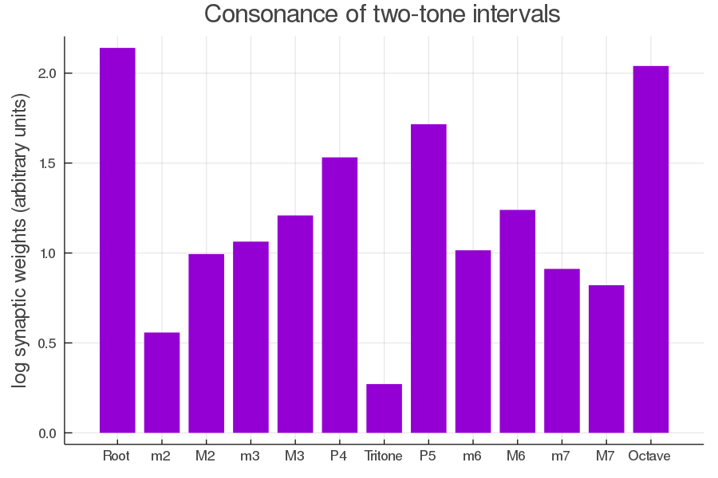

# Extracting Helmholtz's consonance ranking from Hebbian plasticity

Implementation of ["Emergence of the consonance pattern within synaptic weights of a neural network featuring Hebbian neuroplasticity"](https://doi.org/10.1016/j.bica.2017.09.001) (Pankovski and Pankovska, 2017). In short: two layer network accepts one complex tone with some harmonics on top, with subsequent rewiring by [Hebbian rule](https://en.wikipedia.org/wiki/Hebbian_theory). Prevalent consonance ranking of two-tone intervals is then extracted from weights of the network.



## Reproduce

```bash
julia -e 'using Pkg; Pkg.activate(); Pkg.instantiate()' # install dependencies

julia --project trivial-consonance.jl

feh reproduce-ranking.png
```

Calculations run under 10 seconds (improvement over 24 hours mentioned in the paper). Ranking recovered:

```
Root > Octave > P5 > P4 > M6 > M3 > m3 > m6 > M2 > m7 > M7 > m2 > Tritone
```

## Discussion

Due to simplicity of the algorithm proposed, it diverges after many training steps and is highly dependent on the number of harmonics and their magnitude.

###### (original implementation is behind a paywall)
